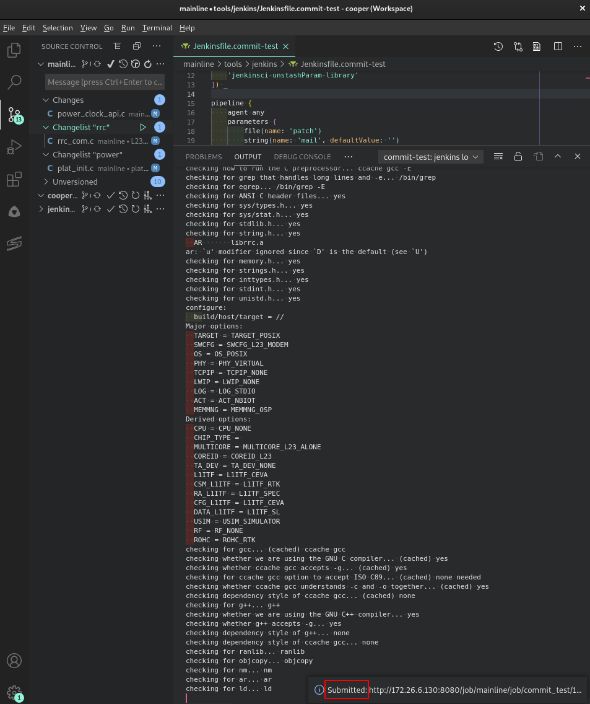

# commit-test

[cmgk](http://172.26.6.129/scm/cmgk.git) commit-test client for VSCode,
which submits test to
[our Jenkins service](http://172.26.6.130:8080/mainline/commit_test),
is an alternative to the original command-line based client, which submit test
to the legacy [celeryd service](amqp://cmgk@172.26.6.130).

> The legacy celeryd service will not receive any further improvements in the
> future. Please switch to the Jenkins service even you are not going to use
> this extension.

## Features

*   Support multi-root VSCode workspace
    *   Let user select a folder with valid `svn` workspace among those detected
*   Support `svn` changelist
    *   Let user select a changelist (or default) to submit test for
*   Status update
    *   Live Jenkins logging on a dedicated output window
    *   Retrieve ticket on completion

## Extension Settings

```json
{
    "commi-test": {
        "jenkins": {
            "account": {
                // Valid account which can login to the Jenkins service (usually your NT account), mandatory
                "user": "your.name",
                "password": "password",

                // Mail address to send notification to, optional
                "mail": "your.mail@realtek.com",
            },

            // Jenkins host and job to submit test to, optional and default to the following value.
            // Use default (just leave them undefined) unless you know what you are doing.
            "hostAddress": "http://172.26.6.130:8080",
            "jobName": "mainline/commit_test"
        }
    }
}
```

## Installation

This extension is not pulished to official VSCode repository. Before it is made
availabe via any repository, public or private, please install it offline.

Please downalod the latest release (in `.vsix`) from the
[release page](http://172.26.6.129/jy.hsu/vscode-commit-test/-/releases).
Install it directly with command:

```sh
code --install-extension commit-test-0.0.1.vsix
```

## Commands

This extension provides its functionality via commands. Please find the commands
under "Commit-Test" category from command palette
(<kbd>ctrl</kbd>+<kbd>shift</kbd>+<kbd>p</kbd>).


### `Verfy Environment`

It is recommended to use `Verify Environment` to make sure that the settings are
properly configured and Jenkins service can be accessed. The result will be
displayed with notification.


### `Submit Commit-Test`

This is the main command for this extension (more will come in the future..
:coffee:).

By default, it submits diff of the `svn` workspace in question to our Jenkins
service. If successfully submitted, a notification will be popped up to inform
URL of the Jenkins build:



and a output console will update the Jenkins console:


On completion, the result will be informed with a notification. In case of
`SUCCESS`, the ticket will be contained.


If you somehow missed the notification, find the ticket in Jenkins log (either
in the output console or Jenkins web) or the mail notification.

## `svn` changelist support

`svn` supports [changelists](http://svnbook.red-bean.com/en/1.6/svn.advanced.changelists.html)
to manage multiple changes within a single workspace. `Submit Commit-Test`
supports submitting diff/patch of specific changelist (or default) by offering
selection of changelist in case at least one changelist exists:


But the operations of changelists, such as creation, moving files, removal or
committing, are still left to the `svn` client you use. Just remember to commit
the changelist you submit commit-test for.

## Multi-root workspace support

This extension is aware of [multi-root workspace](https://code.visualstudio.com/docs/editor/multi-root-workspaces).
While more than one folders under the multi-root workspace is applicable to the
command issued, a prompt will be popped up to ask for the folder to work with.


Selecting folder has two meanings:

*   The settings to use. If your settings are in folder scope, selecting that
    folder also select the settings to use.

    > The settings can be placed in higher scopes (workspace- or even
    > user-scope)

*   For commands like `Submit Commit-Test`, it is only meaningful with a folder
    containing valid `svn` workspace. Selecting a folder (with valid `svn`
    workspace) not only determines the settings to use, but where to gather
    diff/patch to submit commit-test for.

## Release Notes

See [CHANGELOG.md](CHANGELOG.md)
