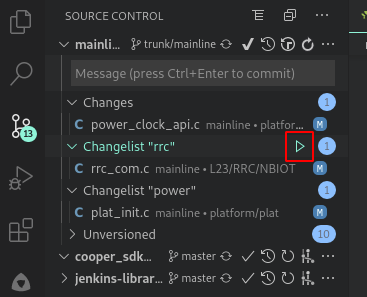

# commit-test

[cmgk](http://172.26.6.129/scm/cmgk.git) commit-test client for VSCode,
which submits test to
[our Jenkins service](http://172.26.6.130:8080/mainline/commit_test),
is an alternative to the original command-line based client, which submit test
to the legacy [celeryd service](amqp://cmgk@172.26.6.130).

> The legacy celeryd service will not receive any further improvements in the
> future. Please switch to the Jenkins service even you are not going to use
> this extension.

Pre-commit test for Cooper is also supported (experimentally).

> We plan to add more Jenkins jobs will in the future.

## Features

*   Support `svn` changelist
    *   Let user select a changelist (or default) to submit test for

    > The operations of changelists, such as creation, moving files, removal or
    > committing, are still left to the `svn` client you use.

*   Status update
    *   Live Jenkins logging on a dedicated output window
    *   Retrieve ticket on completion
*   Support multi-root VSCode workspace
    *   Explicitly, by letting user select a folder with valid `svn` workspace
        among those detected
    *   Or implicitly, by starting test against the selected changelist

## Extension Settings

```json
{
    "commit-test": {
        "jenkins": {
            "account": {
                // Valid account which can login to the Jenkins service (usually your NT account), mandatory
                "user": "your.name",
                // Password for the valid account
                "password": "password",

                // Mail address to send notification to, optional
                "mail": "your.mail@realtek.com",
            },

            // Jenkins host to submit test to, just use default
            "hostAddress": "http://172.26.6.130:8080",

            "commit-test": {
                // Jenkins job to submit commit-test to, just use default
                "jobName": "mainline/commit_test"
            },
            "pre-commit": {
                // Jenkins job to submit pre-commit to, just use default
                "jobName": "cooper/pre-commit",
                // Parameters for pre-commit. Normally these will be tweaked for individual test.
                "parameters": {
                    // Extra variables to use while configuring modem. Do not define CPPFLAGS variable here, please use modem_cppflags for macro defining.
                    "modem_config": "",
                    // Extra CPPFLAGS to use while building modem.
                    "modem_cppflags": "",
                    // Extra variables to use while building AP. Do not define CPPFLAGS variable here, please use ap_cppflags for macro defining.
                    "ap_config": "",
                    // Extra CPPFLAGS to use while building AP
                    "ap_cppflags": ""
                },
                // Test case to perform. Supported cases are: "ping", "ping_after_idle", "Eclipse_Leshan", "ping_100_times", "long_idle"
                "testcase": "ping"
            }
        }
    }
}
```

## Installation

This extension is not pulished to official VSCode repository. Before it is made
availabe via any repository, public or private, please install it offline.

Please downalod the latest release (in `.vsix`) from the
[release page](http://172.26.6.129/jy.hsu/vscode-commit-test/-/releases).
Install it directly with command:

```sh
code --install-extension commit-test-0.0.1.vsix
```

## Basic Usage

The easiest way to use the extension is to submit commit-test by clicking the
`Submit Commit-Test for Changelist` icon of the target changelist:



Wait several seconds for the extension to submit diff/patch of the change list
to Jenkins. Once successfully submitted, a notification will be popped up to
inform URL of the Jenkins build, and a output console will update the Jenkins
console:


On completion, the result will be informed with a notification. In case of
`SUCCESS`, there are several ways to get the ticket issued:

*   The complete notification contains the ticket
*   Changelists with ticket available are labeled a bookmark icon (corresponding
    to `Get Ticket for Changelist` command), click it to query the ticket

    > See the [limitations](#Limitations)

*   Ticket can also be found in Jenkins log (either in the output console or
    Jenkins web)
*   Mail notification, sent to the mail address in


## Commands

There are also commands (under "Commit-Test" category) which can be launched
from the command palette
(<kbd>ctrl</kbd>+<kbd>shift</kbd>+<kbd>p</kbd>).


### `Verfy Environment`

It is recommended to use `Verify Environment` to make sure that the settings are
properly configured and Jenkins service can be accessed. The result will be
displayed with notification.


### `Submit Commit-Test`

This is an alternative way to submit commit-test. The difference is in that
`svn` folder and changelist to submit commit-test for are selected with quick
pick (if selection is necessary).

### `Submit Pre-Commit-Test for Cooper`

Not directly related to `cmgk`, but should be handy for people who utilizes
`cooper/pre-commit` to perform automated test on Cooper board.

Launching test should be straightforward. Remember to specify build
configurations and test case via settings:

*   `commit-test.jenkins.pre-commit.parameters`
*   `commit-test.jenkins.pre-commit.testcase`

## `svn` changelist support

`svn` supports [changelists](http://svnbook.red-bean.com/en/1.6/svn.advanced.changelists.html)
to manage multiple changes within a single workspace. Both
`Submit Commit-Test for Changelist` and `Submit Commit-Test` commands support
submitting diff/patch of specific changelist (or default) by offering selection
of changelist (in case at least one changelist exists for `Submit Commit-Test`).

But the operations of changelists, such as creation, moving files, removal or
committing, are still left to the `svn` client you use. Just remember to commit
the changelist you submit commit-test for.

## Multi-root workspace support

This extension is aware of
[multi-root workspace](https://code.visualstudio.com/docs/editor/multi-root-workspaces).

> For `Submit Commit-Test` command, while more than one folders under the
> multi-root workspace is applicable to the command issued, a prompt will be
> popped up to ask for the folder to work with.

Selecting folder has two meanings:

*   The settings to use. If your settings are in folder scope, selecting that
    folder also select the settings to use.

    > The settings can be placed in higher scopes (workspace- or even
    > user-scope)

*   For commands like `Submit Commit-Test`, it is only meaningful with a folder
    containing valid `svn` workspace. Selecting a folder (with valid `svn`
    workspace) not only determines the settings to use, but where to gather
    diff/patch to submit commit-test for.

## Limitations

*   Ticket availability indicator cannot distinguish different `svn` folders in
    a multi-root workspace. That is, if we have two changelists in folder `foo`
    and `bar` both named `my-fance-cl` and the one in folder `foo` got ticket,
    the `my-fancy-cl` changerlist will also have ticket availability indicated.

    > Default changelists in different `svn` folders, unfortunately, have
    > identical names.

    But don't worry that the tickets are associated with wrong changelists. The
    ticket will only be responded for the changelist that really owns one (that
    is, the one in folder `foo` in the above case), the changelist that does not
    own a ticket responds "n/a".

## Release Notes

See [CHANGELOG.md](CHANGELOG.md)
