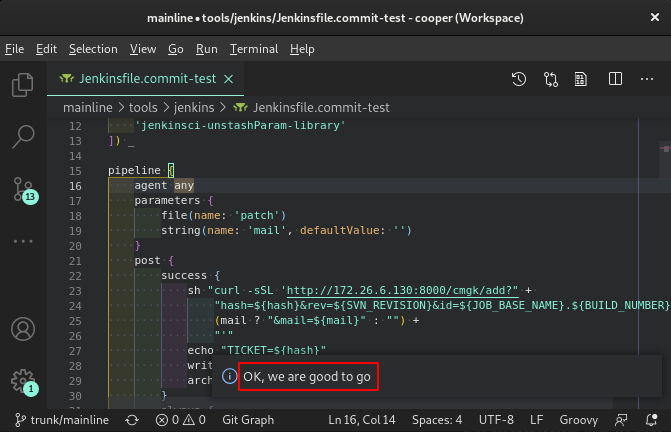

# commit-test

VSCode Jenkins client to submit tests for Cooper workspace. Currently the only
supported test is sanity test, which let users test/debug their change on real
board.

> [cmgk](http://172.26.6.129/scm/cmgk.git) commit-test functionalities were
> removed since `0.0.8`, as modem code base was moved from svn to SDLC-Gerrit
> and the pre-commit verification is integrated with Gerrit code-review
> workflow.

## Extension Settings

The settings are expected to be at workspace-level instead of folder-level. That
is, they should appear in `.code-workspace` file.

```json
{
    "commit-test": {
        "jenkins": {
            "account": {
                // Valid account which can login to the Jenkins service (usually your NT account), mandatory
                "user": "your.name",
                // Password for the valid account
                "password": "password",
                // Mail address to send notification to, optional
                "mail": "your.mail@realtek.com",
            },

            // Jenkins host to submit test to, just use default
            "hostAddress": "http://172.26.6.130:8080",
        },
        "workspace": {
            // Folder name of modem in the multi-root workspace, recommend to follow the default
            "modem": "modem",
            // Folder name of AP in the multi-root workspace, recommend to follow the default
            "ap": "cooper_sdk"
        },
        "sanity": {
            // Jenkins job to submit sanity test to, just use default
            "jobName": "SDLC/cooper/sanity",
            // Parameters for sanity test. Normally these will be tweaked for individual test.
            "parameters": {
                "modem": {
                    // Revision to checkout while building modem
                    "revision": "master"
                    // Extra variables to use while configuring modem. Do not define CPPFLAGS variable here, please use modem_cppflags for macro defining.
                    "modem_config": "",
                    // Extra CPPFLAGS to use while building modem.
                    "modem_cppflags": "",
                },
                "ap": {
                    // Revision to checkout while building AP
                    "revision": "master"
                    // Extra variables to use while building AP. Do not define CPPFLAGS variable here, please use ap_cppflags for macro defining.
                    "ap_config": "",
                    // Extra CPPFLAGS to use while building AP
                    "ap_cppflags": ""
                },
                // Test case to perform. Supported cases are: "ping", "ping_after_idle", "Eclipse_Leshan", "ping_100_times", "long_idle"
                "testcase": "ping"
            }
        }
    }
}
```

## Installation

This extension is not pulished to official VSCode repository. Before it is made
availabe via any repository, public or private, please install it offline.

Please downalod the latest release (in `.vsix`) from the
[release page](http://172.26.6.129/jy.hsu/vscode-commit-test/-/releases).
Install it directly with command:

```sh
code --install-extension commit-test-0.0.1.vsix
```

## Workspace layout

As Cooper uses two seperate code bases, one for modem and the other for AP, we
assume both of them, if used, are within a multi-root workspace (please refer to
[multi-root workspace](https://code.visualstudio.com/docs/editor/multi-root-workspaces))

The extension follows the setting `commit-test.workspace` to find modem/AP
folders. `commit-test.workspace.modem`/`commit-test.workspace.ap` specifies the
name of modem/AP folders appearing in current workspace respectively.

There can be zero, one or more modem folders in the workspace, but only the one
specified by `commit-test.workspace.modem` is used by the extension. If there's
no folder with name specified by `commit-test.workspace.modem`, user will not be
prompted to select one. If none is selected, modem part will be ignored.

The same applies to AP as well.

> Note that the extension setting is expected to be at workspace-level.

## Usage

The commands are under "Commit-Test" category, which can be launched from the
command palette
(<kbd>ctrl</kbd>+<kbd>shift</kbd>+<kbd>p</kbd>).


### `Verfy Environment`

It is recommended to use `Verify Environment` to make sure that the settings are
properly configured and Jenkins service can be accessed. The result will be
displayed with notification.



### `Submit Sanity-Test for Cooper`

This sanity-test should be handy for people who utilizes `SDLC/cooper/sanity` to
perform automated test on Cooper board.

Launching test should be straightforward. Remember to specify build
configurations and test case via settings `commit-test.sanity.parameters`

## Release Notes

See [CHANGELOG.md](CHANGELOG.md)
